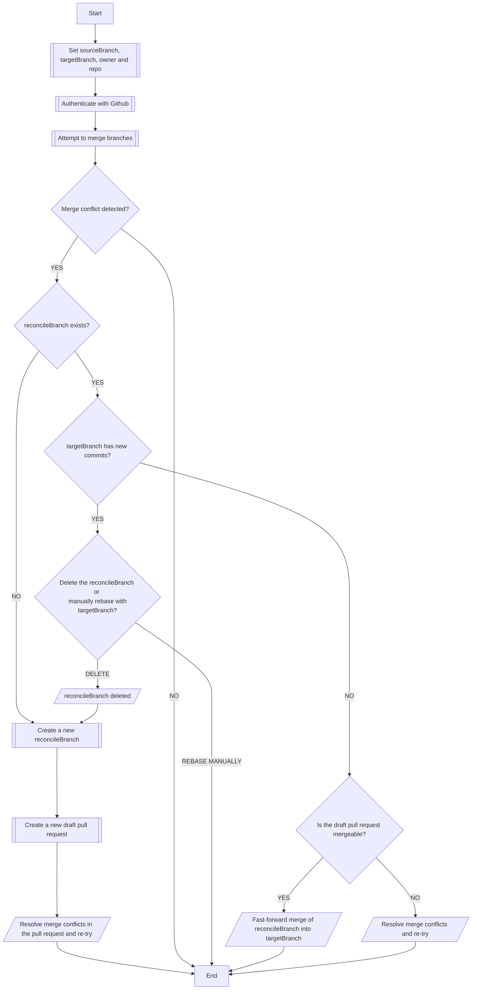
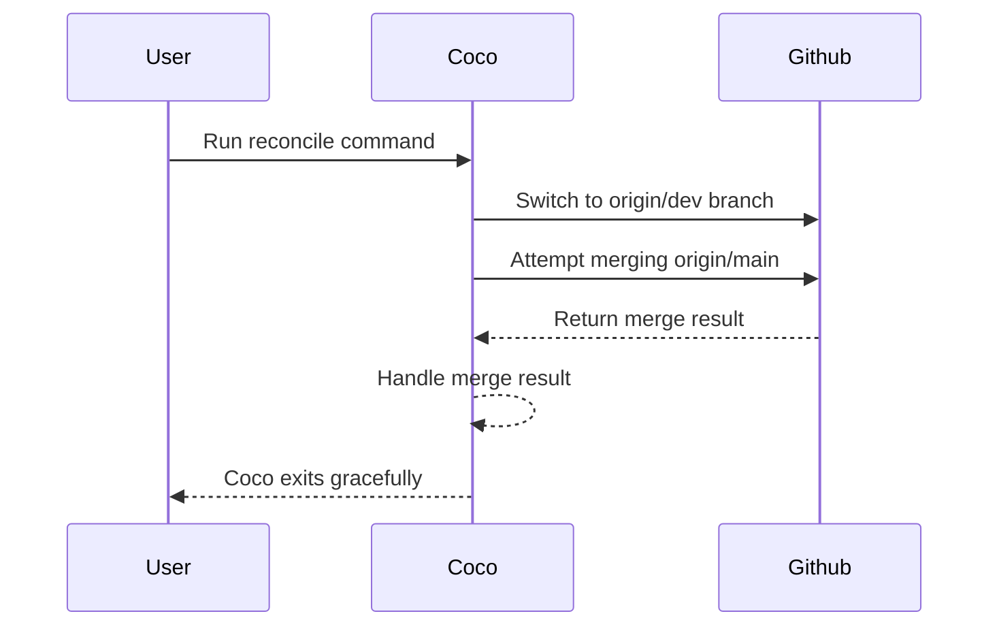

# Reconcile Package

The package in this folder helps to reconcile a target branch with a source
branch.

## Usage

```shell
coco reconcile \
  --source <source_branch> \
  --target <target_branch> \
  --owner <owner_name> \
  --repo <repo_name> \
  [--dry-run]
```

For the reconcile command usage please run

```shell
coco reconcile --help
```

## Command Details



## Authentication

For pushing to Github, this command requires access to a GitHub personal access
token. The token must be stored in the GITHUB_TOKEN environment variable.

## Example

```shell
coco reconcile --source main --target dev --owner myorg --repo myrepo
```

This will reconcile the `origin/dev` branch with the `origin/main` branch in the
`myorg/myrepo` repository. If there are merge conflicts, it will create a new
branch named `reconcile/main-dev` from the `origin/dev` branch, and then attempt
to merge the `origin/main` branch into it. If there are no merge conflicts, it
will merge the `origin/main` branch into the `origin/dev` branch directly.


